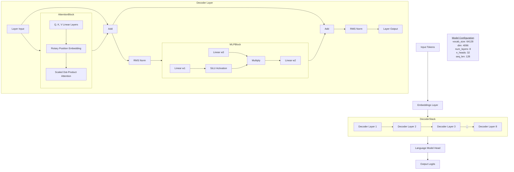

# Building Mooshak 

## Architecture of Mooshak 

```mermaid
graph TD
    Input[Input Tokens] --> Embeddings[Embeddings Layer]
    Embeddings --> DecoderStack[Decoder Stack]
    DecoderStack --> LMHead[Language Model Head]
    LMHead --> Output[Output Logits]

    subgraph DecoderStack
        D1[Decoder Layer 1]
        D2[Decoder Layer 2]
        D3[Decoder Layer 3]
        DN[Decoder Layer 8]
        D1 --> D2
        D2 --> D3
        D3 --> |...| DN
    end

    subgraph DecoderLayer[Decoder Layer]
        Input2[Layer Input] --> AttentionBlock[Attention Block]
        AttentionBlock --> Add1[Add]
        Input2 --> Add1
        Add1 --> RMSNorm1[RMS Norm]
        RMSNorm1 --> MLPBlock[MLP Block]
        MLPBlock --> Add2[Add]
        Add1 --> Add2
        Add2 --> RMSNorm2[RMS Norm]
        RMSNorm2 --> Output2[Layer Output]
    end

    subgraph AttentionBlock
        QKV[Q, K, V Linear Layers]
        RoPE[Rotary Position Embedding]
        SDPA[Scaled Dot-Product Attention]
        QKV --> RoPE
        RoPE --> SDPA
    end

    subgraph MLPBlock
        W1[Linear w1]
        W2[Linear w2]
        W3[Linear w3]
        Swish[SiLU Activation]
        W1 --> Swish
        W3 --> Multiply
        Swish --> Multiply
        Multiply --> W2
    end

    classDef config fill:#f9f,stroke:#333,stroke-width:2px;
    class Config config;

    Config[<u>Model Configuration</u><br/>vocab_size: 64128<br/>dim: 4096<br/>num_layers: 8<br/>n_heads: 32<br/>seq_len: 128]
```
